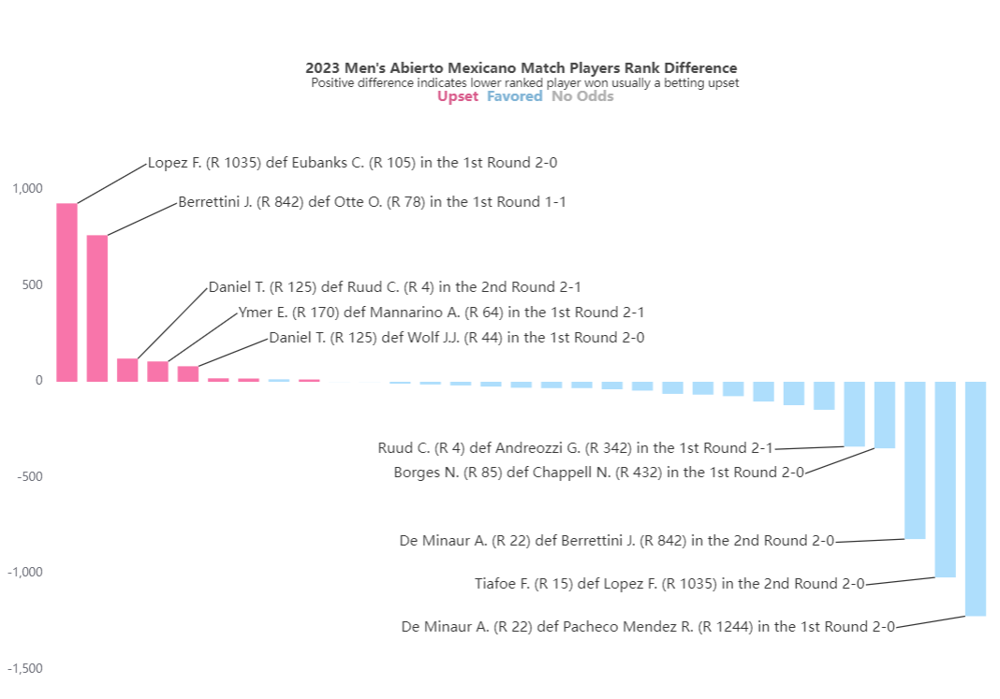

# Tennis Data Visualizations

Tennis match data from <a href="http://tennis-data.co.uk" target="_blank">tennis-data.co.uk</a> visualized to highlight match outcome and player ranks against match betting odds specifically to show match upsets where lower ranked player beats higher ranked player against odds. In the sample visualization the rank bars are sorted by rank difference (lower rank minus higher rank). The bar color indicates if the match outcome as upset (pink), favored (blue) or no odds given/available (grey).

View the interactive visualization: <a href="https://009co.com/public_data/tennis_data?year=2023+Men%27s&tournament=Abierto+Mexicano" target="_blank">https://009co.com/public_data/tennis_data?year=2023+Men%27s&tournament=Abierto+Mexicano</a>.

Read a related blog post about the legend: <a href="https://009co.com/?p=2106" target="_blank">https://009co.com/?p=2106</a>

## License

This project is licensed under the [NAME HERE] License.

## Acknowledgments

ChatGPT-4-Turbo