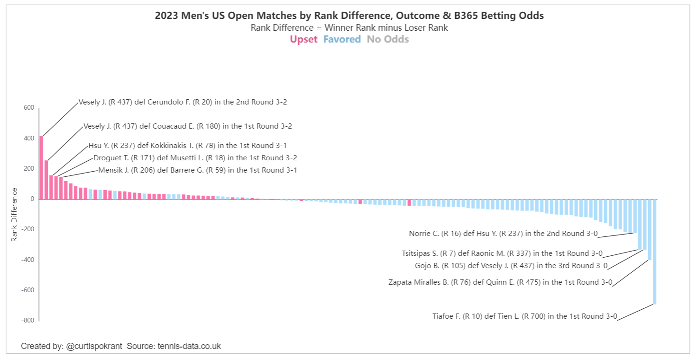

# Tennis Data Visualizations

Tennis match data from <a href="http://tennis-data.co.uk" target="_blank">tennis-data.co.uk</a> visualized to highlight match outcome and player ranks against match betting odds specifically to show match upsets where lower ranked player beats higher ranked player against odds.

In the sample visualization screenshot below the rank bars are sorted by rank difference (lower rank minus higher rank). The bar color indicates if the match outcome as upset (pink), favored (blue) or no odds given/available (grey). A tabular presentation of the data is also provided for each tournament.

View the interactive visualizations: <a href="https://curtispokrant.com/public_data/tennis_data?year=2023+Men%27s&tournament=US+Open" target="_blank">https://curtispokrant.com/public_data/tennis_data?year=2023+Men%27s&tournament=US+Open</a>.

Read a related blog post about the legend customization: <a href="https://009co.com/?p=2106" target="_blank">https://009co.com/?p=2106</a>

## Acknowledgments

ChatGPT-4-Turbo
